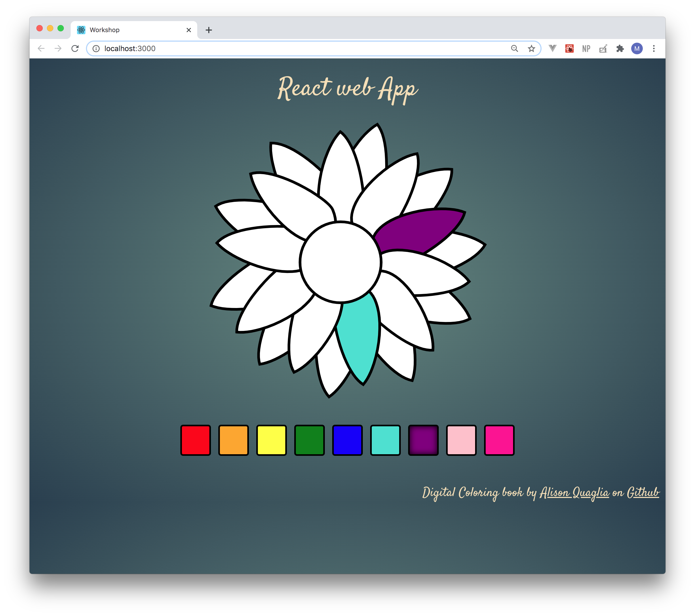

## Example of React Web Application 

### Summary
This is a basic digital coloring book, created by Alison Quaglia. I encourage you to check out her other works, especially [coloring book with National parks](https://github.com/hylobates-lar/coloring_book_frontend)! It's awesome!!! 😍

##### Getting Started
For this workshop clone this repo by running command:
`git clone https://github.com/binpipe/color-test-app.git`

##### Install dependencies

`yarn install`

##### Run Snap Shot from the root directory

`yarn start`

##### Build the image  

`docker build -t workshop:latest .`

##### Run the container locally

`docker run -it -p 8080:80 workshop:latest`

During the workshop we will create a private registry on AWS, then push image to `workshop` repository.
Then we will provision infrastructure on AWS using Terraform (for this step go to this [repo](https://github.com/binpipe/ecs_terraform_workshop)).

